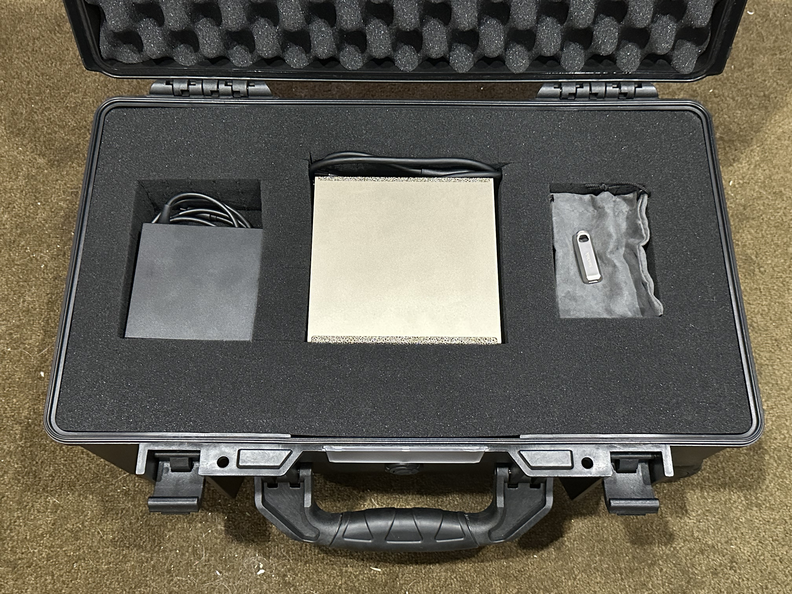
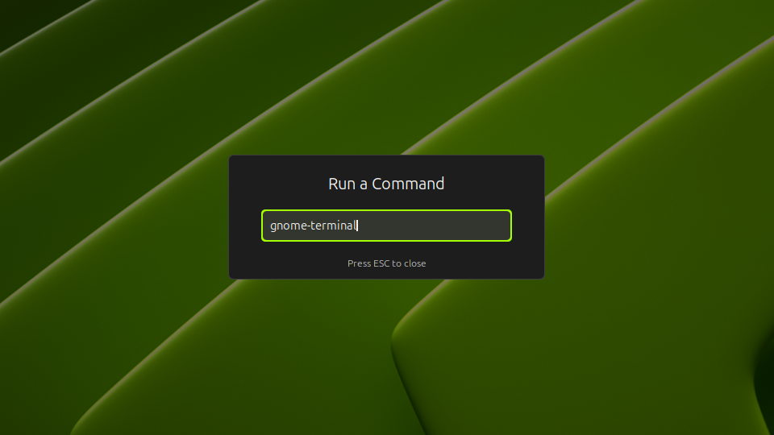
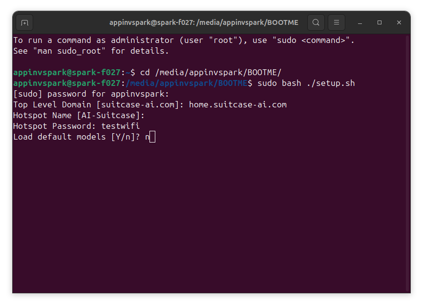
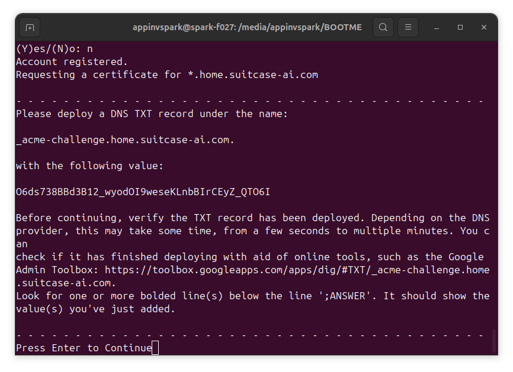
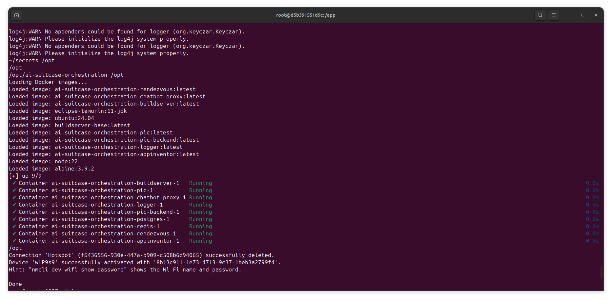
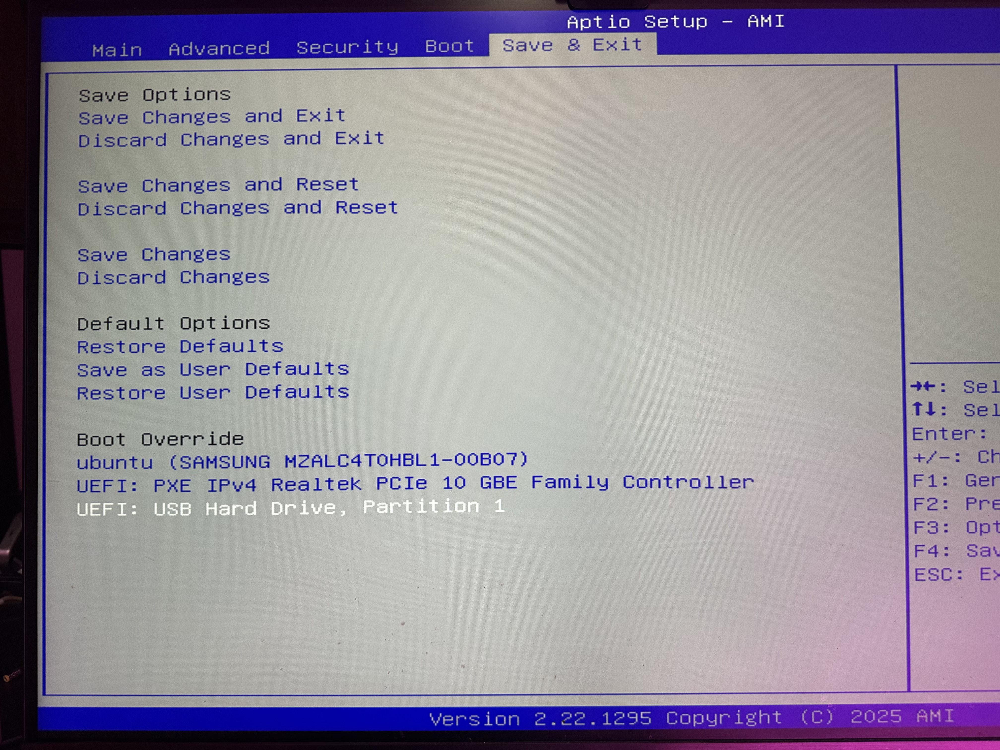
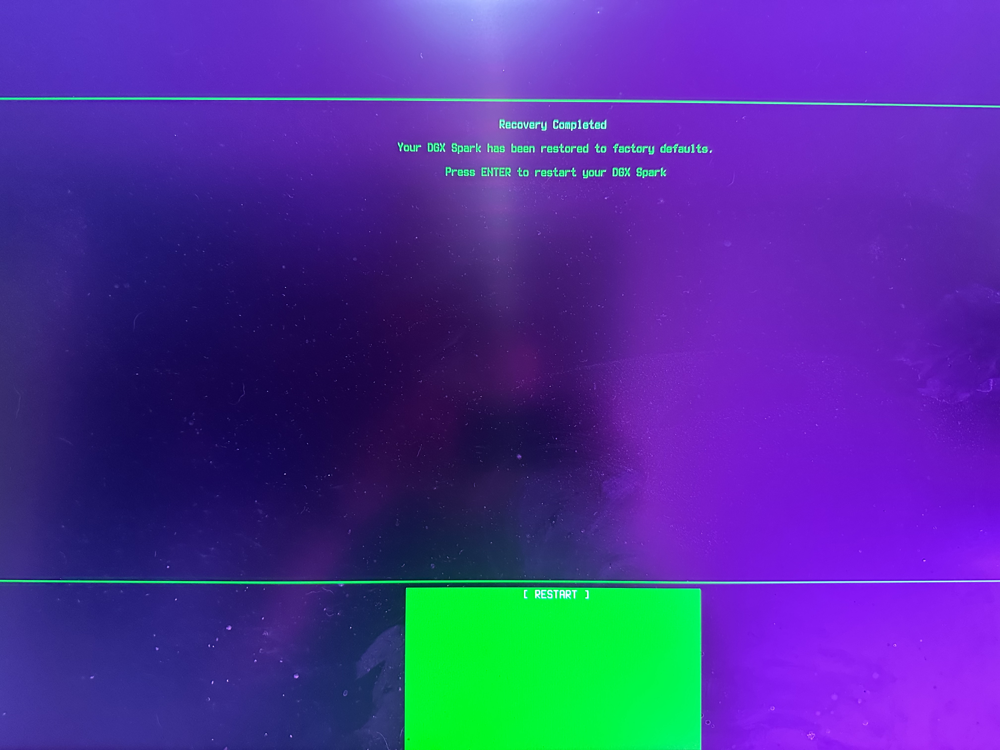

# Welcome to the Small AI in a Suitcase Platform

In the suitcase, you will find the following items:

1. NVIDIA Spark
2. Power brick + power cable
3. Magnifier phone attachment
4. Recovery and setup USB drive

Connect the power cable to the power brick. Plug the cable into the
wall socket and the USB-C end of the power brick to the NVIDIA Spark
to boot it. The Spark should be already set up to run the Small AI in
a Suitcase platform. If not, insert the USB-C thumb drive with the
setup software and proceed to the Setup Instructions below.

## Prerequisites

* Familiarity with the Linux command line interface
* Familiarity with Let's Encrypt certbot tool (necessary to enable secure connections)
* Root access to the target NVIDIA Spark
* Internet access from the NVIDIA Spark to install support packages
* A domain name and the ability to manage the DNS entries for that domain

## Setup Instructions

1. Prepare a domain name where you can set up DNS TXT records to
   authenticate Let's Encrypt certbot (ACME protocol) responses. You
   MUST create a wildcard domain under your top level domain.
2. Open a terminal or connect to the Spark using SSH.

    

3. Run the following command to bootstrap the system:

    1. Internet: `curl -sL https://appinventor-foundation.github.io/ai-suitcase/setup.sh | sudo bash`
    2. Local: `sudo base /media/*/BOOTME/setup.sh`

4. The setup script will prompt for the following pieces of information:

    1. Root domain name for your service created in step 1 (default: suitcase-ai.com)
    2. Name for the hotspot SSID (default: AI-Suitcase)
    3. Desired password for the hotspot
    4. Load default models [Y/n] (yes will download Google Medgemma and OpenAI GPT-OSS LLMs for offline use)

    

5. To provide secure, encrypted connections, AI Suitcase makes use of
   Let’s Encrypt. When you reach the point where the setup script
   creates the SSL certificate, you will be prompted to input contact
   information and accept the Let's Encrypt Terms of Service. Once
   you’ve accepted the terms, you will be prompted to create a TXT
   record to confirm ownership of the domain provided in steps 1 and
   4:

    

6. Once complete, the setup script will print “Done”

    

## Recovery Instructions

1. The NVIDIA Spark can be reset using a USB-C thumb drive following
   the instructions at
   https://docs.nvidia.com/dgx/dgx-spark/system-recovery.html. Optionally,
   you can download setup.sh and images.tar.bz2 to the thumb drive
   after initializing it with the NVIDIA script. In this case, run the
   setup script directly from the thumb drive and it will use the
   images.tar.bz2 file rather than downloading it from the Internet.
2. Press the DELETE key while booting the Spark to access the Setup
   menu, navigate to Save & Exit, and select the USB drive configured
   in step 1:

    

3. Follow the onscreen prompts. Once the recovery is complete, you
   should see the following screen. Pressing ENTER will reboot the
   Spark into a factory default configuration.



	

4. After resetting the Spark, you will need to run the setup
   instructions again to provision it for use. If you saved the script
   and image to disk, use the "Local" command under step 3. Otherwise,
   use the "Internet" command.
